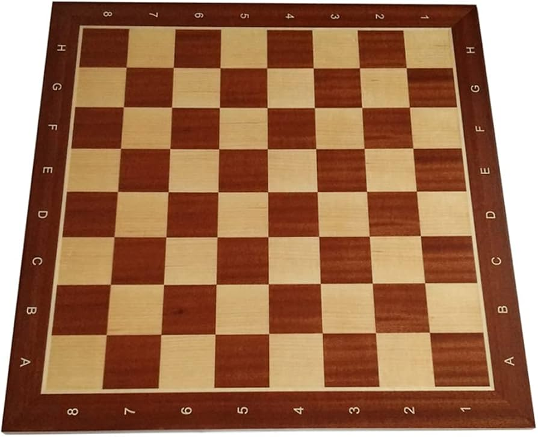

# Chessboard-Camera-Calibration

The Python script performs several operations for camera calibration, including manual selection of images, detection of chessboard corners, estimation of intrinsic and extrinsic parameters, as well as real-time pose estimation.

1. Function: select_input()
This function allows users to manually or automatically select images from a video input. The main features include displaying the video stream, detecting the corners of a chessboard, and enabling the user to save the desired images by pressing specific keys.

3. Function: calib_camera()
This function processes the selected images to calculate the intrinsic matrix (K), the distortion coefficients, and the RMS calibration error. It uses the cv.calibrateCamera() function from OpenCV for this purpose.

